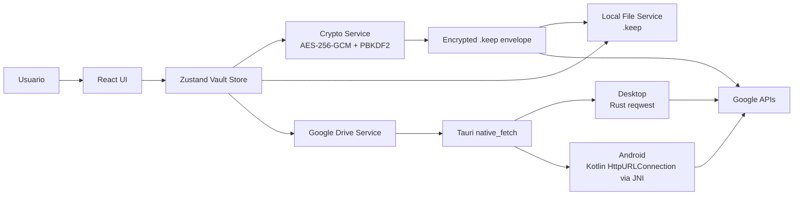
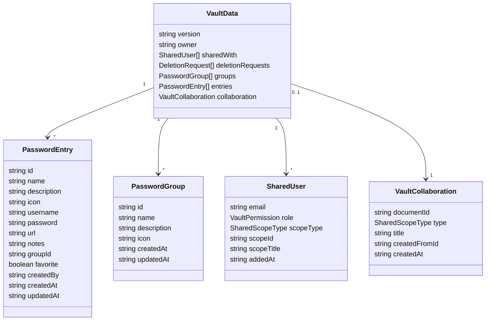
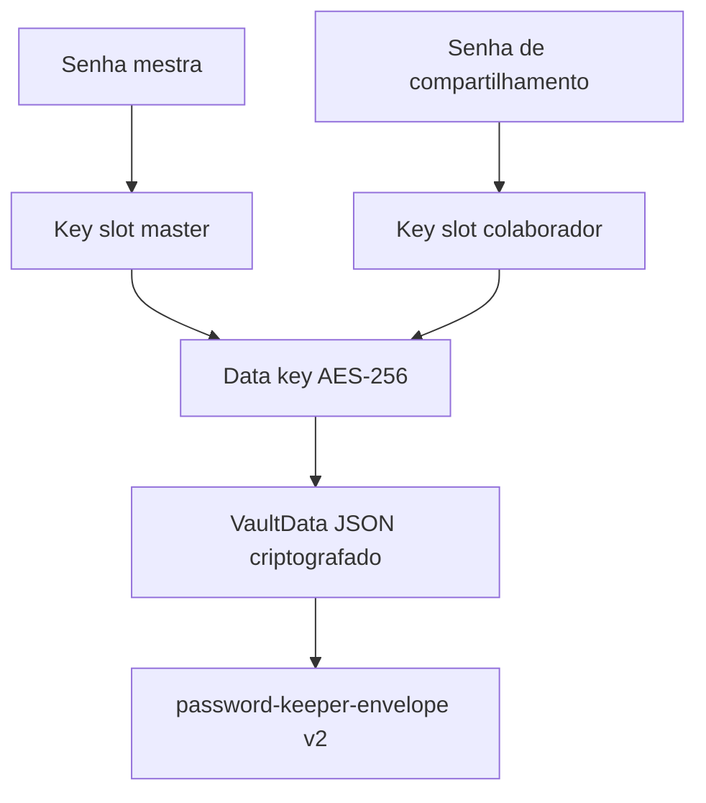
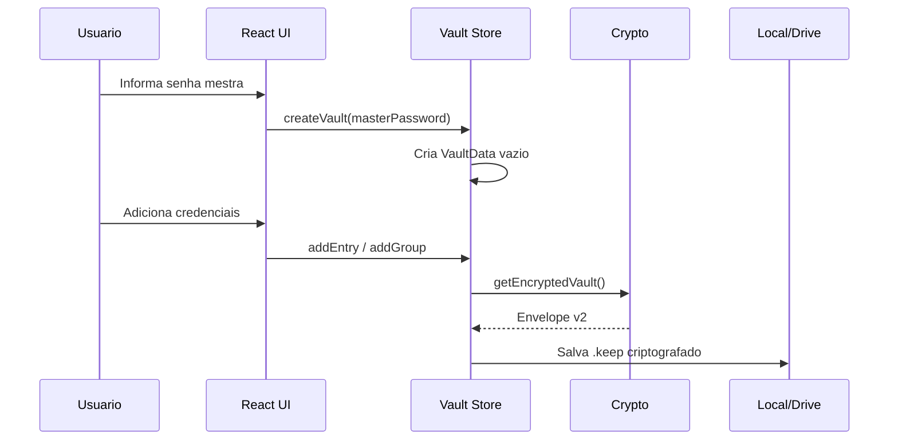
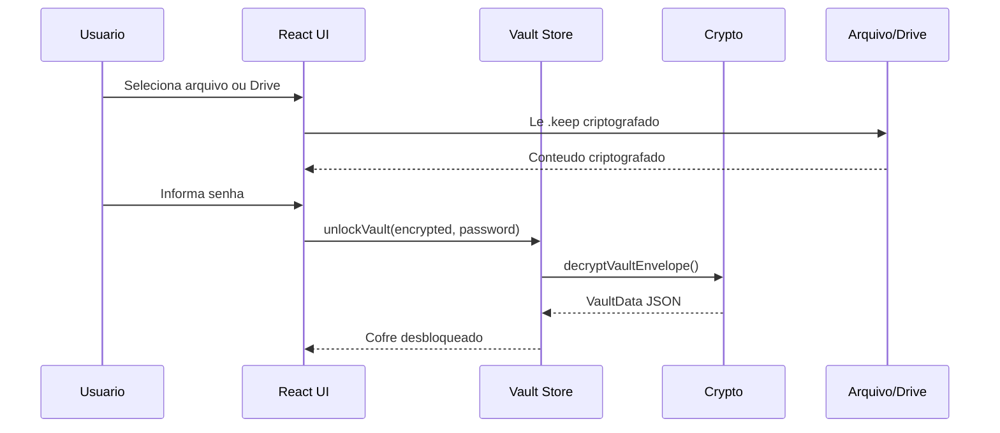
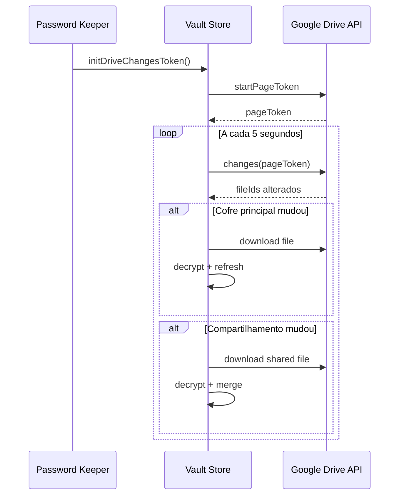
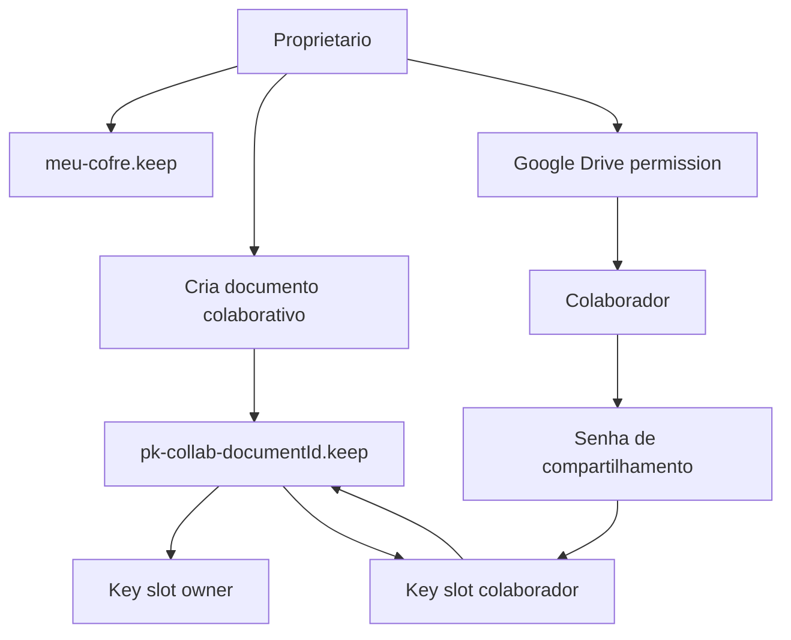
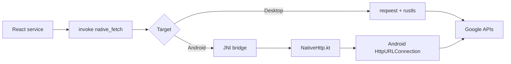

# Password Keeper

Password Keeper e um cofre de senhas multiplataforma feito com **Tauri 2**, **React 18**, **TypeScript**, **Rust** e **Zustand**. O projeto foi desenhado para manter credenciais pessoais e compartilhadas criptografadas antes de qualquer persistencia local ou envio ao Google Drive.

O objetivo deste README e ser o documento de referencia do projeto: produto, arquitetura, seguranca, fluxos, desenvolvimento, release e downloads.

## Downloads

Versao publica mais recente: **v0.2.5**

Pagina da release: [Password Keeper v0.2.5](https://github.com/mpblima/passwordKeeper/releases/tag/v0.2.5)

| Plataforma | Arquivo recomendado | Link direto |
|---|---:|---|
| Windows | `.exe` installer | [Password.Keeper_0.2.5_x64-setup.exe](https://github.com/mpblima/passwordKeeper/releases/download/v0.2.5/Password.Keeper_0.2.5_x64-setup.exe) |
| Windows | `.msi` installer | [Password.Keeper_0.2.5_x64_en-US.msi](https://github.com/mpblima/passwordKeeper/releases/download/v0.2.5/Password.Keeper_0.2.5_x64_en-US.msi) |
| macOS Apple Silicon | `.dmg` | [Password.Keeper_0.2.5_aarch64.dmg](https://github.com/mpblima/passwordKeeper/releases/download/v0.2.5/Password.Keeper_0.2.5_aarch64.dmg) |
| macOS Intel | `.dmg` | [Password.Keeper_0.2.5_x64.dmg](https://github.com/mpblima/passwordKeeper/releases/download/v0.2.5/Password.Keeper_0.2.5_x64.dmg) |
| Linux | `.AppImage` | [Password.Keeper_0.2.5_amd64.AppImage](https://github.com/mpblima/passwordKeeper/releases/download/v0.2.5/Password.Keeper_0.2.5_amd64.AppImage) |
| Linux Debian/Ubuntu | `.deb` | [Password.Keeper_0.2.5_amd64.deb](https://github.com/mpblima/passwordKeeper/releases/download/v0.2.5/Password.Keeper_0.2.5_amd64.deb) |
| Linux Fedora/RHEL | `.rpm` | [Password.Keeper-0.2.5-1.x86_64.rpm](https://github.com/mpblima/passwordKeeper/releases/download/v0.2.5/Password.Keeper-0.2.5-1.x86_64.rpm) |
| Android | `.apk` side-loading | [PasswordKeeper-0.2.5-android.apk](https://github.com/mpblima/passwordKeeper/releases/download/v0.2.5/PasswordKeeper-0.2.5-android.apk) |

Observacoes:

- O APK Android e assinado por keystore configurada no GitHub Actions.
- macOS e Windows ainda podem exigir confirmacao manual do sistema operacional, dependendo de notarizacao e assinatura do ambiente do usuario.
- Para Android, o APK e distribuido por side-loading. Ative instalacao de fontes confiaveis apenas se voce entende o risco.

## O Que o Produto Faz

Password Keeper guarda credenciais em um arquivo criptografado `.keep`. Esse arquivo pode ficar apenas no dispositivo ou ser sincronizado pelo Google Drive. A senha mestra nunca e enviada ao Google, ao GitHub ou a qualquer backend de terceiros.

Principais recursos:

- Cofre local criptografado com senha mestra.
- Entradas com nome, usuario, senha, URL, descricao, notas e icone.
- Grupos para organizar credenciais.
- Favoritos, busca, visualizacao em grade/lista e detalhes protegidos.
- Gerador de senhas com opcoes de letras, numeros e simbolos.
- Medidor de forca da senha.
- Salvar e abrir arquivo local `.keep`.
- Escolher a localizacao do arquivo `.keep` ao criar um cofre novo no desktop.
- Sincronizar cofre principal com Google Drive.
- Detectar mudancas remotas via Google Drive Changes API.
- Compartilhar cofre, grupo ou entrada como documento colaborativo separado.
- Permissoes por colaborador: leitor, editor e proprietario.
- Senha de compartilhamento separada da senha mestra.
- Auto-save apos alteracoes.
- Auto-lock por inatividade.
- Builds para Linux, Windows, macOS e Android.

## Pagina do Produto

A pagina promocional para GitHub Pages fica em:

- [docs/index.html](docs/index.html)
- Imagem hero: [docs/assets/password-keeper-hero.png](docs/assets/password-keeper-hero.png)

Quando o GitHub Pages estiver apontando para a pasta `docs`, a URL esperada sera:

```text
https://mpblima.github.io/passwordKeeper/
```

A pagina tem portugues como idioma padrao e alternancia para ingles.
Ela tambem inclui links de download por plataforma e um historico simples de versoes para usuarios finais.

## Stack Tecnica

| Camada | Tecnologia |
|---|---|
| App shell | Tauri 2 |
| Backend nativo | Rust |
| Frontend | React 18 + TypeScript |
| Estado | Zustand |
| Estilo | Tailwind CSS |
| Build web | Vite |
| Testes | Vitest + Testing Library + happy-dom |
| Criptografia | Web Crypto API |
| HTTP desktop | Rust `reqwest` via comando Tauri |
| HTTP Android | Kotlin `HttpURLConnection` via JNI |
| OAuth | Google OAuth 2.0 com PKCE |
| Cloud | Google Drive API |
| CI/CD | GitHub Actions |

## Arquitetura Geral



### Principios

1. O cofre descriptografado vive apenas em memoria.
2. Toda persistencia usa conteudo criptografado.
3. A senha mestra nao e persistida.
4. O Google Drive armazena arquivos opacos.
5. Compartilhamentos usam arquivos colaborativos separados.
6. Permissoes da interface sao aplicadas a partir do papel do usuario e do escopo compartilhado.

## Modelo de Dados

Os tipos principais ficam em [src/types/vault.ts](src/types/vault.ts).



### Permissoes

| Papel | Pode visualizar | Pode criar/editar | Pode excluir | Pode gerenciar acesso |
|---|---:|---:|---:|---:|
| `reader` | Sim | Nao | Nao | Nao |
| `editor` | Sim | Sim | Via fluxo autorizado | Nao |
| `owner` | Sim | Sim | Sim | Sim |

Escopos possiveis:

- `vault`: cofre inteiro.
- `group`: grupo e entradas do grupo.
- `entry`: entrada especifica.

## Criptografia

Implementacao: [src/services/crypto.ts](src/services/crypto.ts)

### Algoritmos

- **AES-256-GCM** para cifrar o payload.
- **PBKDF2 SHA-256** para derivar chave a partir de senha.
- **310.000 iteracoes** no PBKDF2.
- Salt de 16 bytes por slot de senha.
- IV de 12 bytes para AES-GCM.
- Chave interna de dados de 32 bytes para envelope v2.

### Envelope v2

O formato atual separa a chave que cifra os dados das senhas autorizadas. Cada senha desbloqueia um `keySlot`, e o `keySlot` desbloqueia a mesma chave de dados.



Formato conceitual:

```json
{
  "format": "password-keeper-envelope",
  "version": 2,
  "payload": {
    "iv": "base64",
    "data": "base64"
  },
  "keySlots": [
    {
      "id": "master",
      "salt": "base64",
      "iv": "base64",
      "encryptedKey": "base64",
      "createdAt": "iso-date"
    }
  ]
}
```

### Legado v1

O app ainda consegue ler o formato legado:

```text
[16 bytes salt][12 bytes iv][ciphertext]
```

Novos arquivos usam envelope v2.

## Fluxos Principais

### Criar Cofre



### Abrir Cofre



### Sincronizacao com Google Drive



### Compartilhamento Colaborativo

Compartilhar nao expõe o arquivo principal do usuario. O app cria um arquivo separado no Google Drive:

```text
pk-collab-<documentId>.keep
```

Esse arquivo contem apenas o escopo compartilhado: cofre inteiro, grupo ou entrada.



### Edicao em Compartilhamento

- Leitores visualizam.
- Editores escrevem no arquivo colaborativo.
- Proprietarios sincronizam alteracoes recebidas para o cofre principal.
- Entradas e grupos compartilhados recebem IDs namespaced no cliente, por exemplo:

```text
shared:<sourceId>:entry:<entryId>
shared:<sourceId>:group:<groupId>
```

Isso evita colisao entre IDs locais e IDs recebidos.

## Tauri e Backend Nativo

Arquivo principal: [src-tauri/src/lib.rs](src-tauri/src/lib.rs)

Comandos expostos ao frontend:

| Comando | Finalidade |
|---|---|
| `start_oauth` | Fluxo OAuth desktop via browser externo e servidor TCP local |
| `start_oauth_android_native` | Fluxo OAuth Android via Kotlin e AppAuth |
| `native_fetch` | Proxy HTTP nativo para contornar CORS e restricoes do WebView |
| `write_file` | Escreve arquivo local |
| `read_file` | Le arquivo local |
| `get_default_vault_path` | Retorna caminho padrao do cofre |
| `pick_and_read_image` | Seleciona icone/imagem no desktop |
| `open_url` | Abre URL no navegador do sistema |
| `exit_app` | Encerra o app |

### HTTP por Plataforma



Motivo do caminho especial no Android: threads NDK podem falhar em DNS e sockets em alguns ambientes Android. Por isso o app delega chamadas HTTP para Kotlin.

## Google OAuth

Implementacao: [src/services/googleDrive.ts](src/services/googleDrive.ts)

### Desktop

- Usa OAuth 2.0 com PKCE.
- Abre o navegador externo.
- Escuta callback local em `http://localhost:8899`.
- O token fica persistido no Tauri Store.
- O fallback `localStorage` nao guarda token sensivel.

### Android

- Usa `VITE_GOOGLE_ANDROID_CLIENT_ID`.
- Usa redirect reverso:

```text
com.googleusercontent.apps.<client-id>:/oauth2redirect
```

- O fluxo nativo e implementado por:
  - [GoogleOAuthManager.kt](src-tauri/gen/android/app/src/main/java/com/passwordkeeper/vault/GoogleOAuthManager.kt)
  - [GoogleOAuthBridge.kt](src-tauri/gen/android/app/src/main/java/com/passwordkeeper/vault/GoogleOAuthBridge.kt)

### Escopos Google

```text
https://www.googleapis.com/auth/drive
https://www.googleapis.com/auth/userinfo.email
```

O escopo `drive` permite buscar, criar, atualizar e compartilhar arquivos `.keep`. Para distribuicao publica ampla, a verificacao OAuth do Google pode ser necessaria.

## Persistencia Local

Camadas:

1. Arquivo `.keep` criptografado no disco.
2. `@tauri-apps/plugin-store` para preferencias e referencias.
3. `localStorage` como fallback sincronizado para cold-start.

Chaves sensiveis devem ficar no Tauri Store. A senha mestra nao e persistida.

## Interface

Componentes principais:

| Arquivo | Responsabilidade |
|---|---|
| [src/App.tsx](src/App.tsx) | Layout principal, auto-save, polling Drive, auto-lock |
| [src/components/MasterPasswordScreen.tsx](src/components/MasterPasswordScreen.tsx) | Criar, abrir e desbloquear cofres |
| [src/components/Sidebar.tsx](src/components/Sidebar.tsx) | Navegacao, grupos, filtros, Drive |
| [src/components/PasswordGrid.tsx](src/components/PasswordGrid.tsx) | Lista/grade de credenciais |
| [src/components/PasswordDetail.tsx](src/components/PasswordDetail.tsx) | Detalhe e acoes da credencial |
| [src/components/PasswordForm.tsx](src/components/PasswordForm.tsx) | Criar/editar credencial |
| [src/components/ShareModal.tsx](src/components/ShareModal.tsx) | Criar compartilhamento |
| [src/components/GoogleDriveModal.tsx](src/components/GoogleDriveModal.tsx) | Conexao e operacoes Drive |
| [src/components/BackupModal.tsx](src/components/BackupModal.tsx) | Backup e exportacao |

## Estrutura do Repositorio

```text
password-keeper/
├── .github/workflows/
│   ├── release.yml
│   ├── security.yml
│   └── build-windows.yml
├── docs/
│   ├── index.html
│   ├── assets/
│   ├── oauth/
│   └── release-readiness.md
├── public/
├── scripts/
│   └── sync-version.js
├── src/
│   ├── components/
│   ├── hooks/
│   ├── services/
│   ├── store/
│   ├── types/
│   └── utils/
└── src-tauri/
    ├── capabilities/
    ├── gen/android/
    ├── icons/
    ├── src/
    ├── Cargo.toml
    └── tauri.conf.json
```

## Requisitos de Desenvolvimento

- Node.js 20 recomendado.
- npm.
- Rust stable.
- Dependencias Tauri da plataforma.
- Para Android:
  - Android SDK.
  - Android NDK.
  - Java 17.
  - Targets Rust Android.
- Projeto Google Cloud com Drive API habilitada.

## Variaveis de Ambiente

Crie `.env` na raiz:

```env
VITE_GOOGLE_CLIENT_ID=SEU_DESKTOP_CLIENT_ID.apps.googleusercontent.com
VITE_GOOGLE_CLIENT_SECRET=GOCSPX-SEU_SECRET
VITE_GOOGLE_ANDROID_CLIENT_ID=SEU_ANDROID_CLIENT_ID.apps.googleusercontent.com
```

O arquivo `.env` nao deve ser commitado.

## Setup Google Cloud

1. Acesse o Google Cloud Console.
2. Crie ou selecione um projeto.
3. Ative a Google Drive API.
4. Crie OAuth Client ID do tipo Desktop app.
5. Configure redirect autorizado:

```text
http://localhost:8899
```

6. Crie OAuth Client ID do tipo Android.
7. Configure:

```text
Package name: com.passwordkeeper.vault
SHA-1: fingerprint da keystore Android usada na release
```

8. Coloque os valores no `.env` local e nos GitHub Secrets.

## Instalar e Rodar

```bash
npm install
npm run tauri dev
```

## Scripts

| Comando | Uso |
|---|---|
| `npm run dev` | Vite dev server |
| `npm run build` | TypeScript + Vite build |
| `npm run preview` | Preview Vite |
| `npm run tauri dev` | App desktop em modo desenvolvimento |
| `npm run tauri build` | Build Tauri desktop |
| `npm test -- --run` | Testes em modo single run |
| `npm run test:watch` | Testes em watch mode |
| `npm run test:coverage` | Cobertura |

## Validacao Local

Frontend:

```bash
npm run build
```

Backend Rust:

```bash
cd src-tauri
cargo check
```

Testes:

```bash
npm test -- --run
```

Build desktop:

```bash
npm run tauri build
```

Build Android:

```bash
npm run tauri android build -- --apk
```

## Testes Automatizados

| Area | Arquivos |
|---|---|
| Criptografia | [src/services/crypto.test.ts](src/services/crypto.test.ts) |
| App e polling | [src/__tests__/App.test.tsx](src/__tests__/App.test.tsx) |
| Store | [src/store/__tests__/vaultStore.test.ts](src/store/__tests__/vaultStore.test.ts), [src/store/vaultStore.refresh.test.ts](src/store/vaultStore.refresh.test.ts) |
| Componentes | [src/components/__tests__/](src/components/__tests__/) |
| Clipboard | [src/utils/clipboard.test.ts](src/utils/clipboard.test.ts) |

## CI/CD

### Security

Workflow: [.github/workflows/security.yml](.github/workflows/security.yml)

Roda em PRs e pushes para `master`.

- `npm audit`
- Gitleaks
- Aikido via GitHub PR Gating

### Release

Workflow: [.github/workflows/release.yml](.github/workflows/release.yml)

Dispara com tags:

```bash
git tag v0.2.5
git push origin v0.2.5
```

Gera:

- Linux `.AppImage`, `.deb`, `.rpm`
- Windows `.exe`, `.msi`
- macOS `.dmg` Intel e Apple Silicon
- Android `.apk`

### Versionamento na Release

O script [scripts/sync-version.js](scripts/sync-version.js) sincroniza `package.json`, `package-lock.json`, `src-tauri/tauri.conf.json` e `src-tauri/Cargo.toml` com a tag durante o workflow.

O script [scripts/update-product-page-version.js](scripts/update-product-page-version.js) sincroniza a pagina publica em `docs` com a tag publicada. Apos a release ser publicada, o workflow atualiza `docs/index.html` e `docs/download.html`, commita em `master` e deixa o GitHub Pages republicar a pagina com os links e o historico da versao corrente.

## Secrets do GitHub Actions

Obrigatorios para recursos Google:

| Secret | Descricao |
|---|---|
| `VITE_GOOGLE_CLIENT_ID` | OAuth Client ID desktop |
| `VITE_GOOGLE_CLIENT_SECRET` | OAuth Client Secret desktop |
| `VITE_GOOGLE_ANDROID_CLIENT_ID` | OAuth Client ID Android |

Recomendados para Android:

| Secret | Descricao |
|---|---|
| `ANDROID_KEYSTORE_B64` | `.jks` codificado em Base64 |
| `ANDROID_KEY_ALIAS` | Alias da chave |
| `ANDROID_STORE_PASSWORD` | Senha do keystore |
| `ANDROID_KEY_PASSWORD` | Senha da chave |

Gerar Base64 da keystore:

```bash
base64 -w 0 release.jks
```

Se `ANDROID_KEYSTORE_B64` estiver ausente ou invalido, o workflow gera uma keystore temporaria. Isso permite build, mas pode quebrar atualizacao Android por assinatura diferente.

## Seguranca Operacional

Nunca commitar:

- `.env`
- `client_secret*.json`
- `*.jks`
- `*.keystore`
- tokens OAuth
- arquivos `.keep` reais de usuarios

Se qualquer segredo for exposto:

1. Revogue no provedor.
2. Gere um novo.
3. Atualize GitHub Secrets.
4. Recrie builds publicos afetados.

## Limitacoes Conhecidas

- Nao ha backend proprio. A colaboracao depende de Google Drive.
- Nao e um editor em tempo real estilo Google Docs. A sincronizacao usa polling eficiente via Drive Changes API.
- O escopo Google Drive pode exigir verificacao OAuth para distribuicao publica ampla.
- Android e distribuido por APK side-loading.
- Assinatura/notarizacao macOS e assinatura Windows podem exigir passos adicionais para experiencia de instalacao sem alertas.

## Roadmap Sugerido

- Publicar politica de privacidade e termos.
- Avaliar migracao de escopo `drive` para `drive.file` com Google Picker.
- Assinar/notarizar macOS.
- Assinar Windows com certificado.
- Publicar canal Android oficial quando houver estrategia de distribuicao.
- Adicionar pagina de suporte.
- Evoluir pagina GitHub Pages com screenshots reais do app instalado.

## Licenca

ISC. Veja [package.json](package.json).
